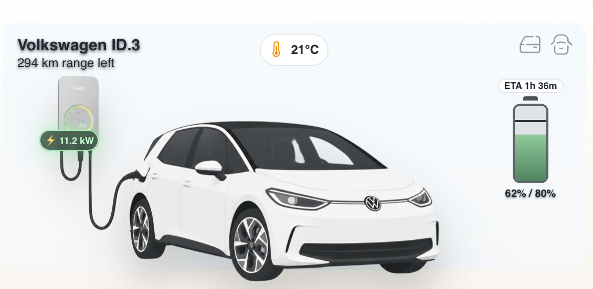

# EV Car Tile Card

A HACS-ready custom card for EV status visualization.



## Install with HACS

1. Add this repository as a **Custom repository** in HACS, category **Dashboard**.
2. Install **EV Car Tile Card**.
3. Reload Home Assistant.
4. Add the resource if needed:
   - URL: `/hacsfiles/hacs-ev-car-tile/ev-car-tile-card.js`
   - Type: `module`

## Hosted Assets

The card uses the hosted car catalog and image assets from:

- https://jolly-pebble-011696d10.7.azurestaticapps.net

## Example Card Configuration

```yaml
type: custom:ev-car-tile-card
name: Polestar 2
entities:
  power: sensor.ev_charge_power
  charge: sensor.ev_battery_level
  target: number.ev_target_charge
  range: sensor.ev_range
  charging: binary_sensor.ev_is_charging
  home: binary_sensor.ev_at_home
  windows_closed: binary_sensor.ev_windows_closed
  doors_closed: binary_sensor.ev_doors_closed
  climate_on: binary_sensor.ev_climate_on
  climate_temp: number.ev_climate_target_temperature
options:
  battery_capacity_kwh: 77
  car_name: polestar
  car_names_csv: polestar, tesla-model-3, tesla-model-y, vw-id.3
  asset_base_path: https://jolly-pebble-011696d10.7.azurestaticapps.net/assets/{{car name}}/images
  show_eta_when_not_charging: false
actions:
  set_climate:
    service: climate.set_temperature
    data:
      entity_id: climate.ev
  set_target:
    service: number.set_value
    data:
      entity_id: number.ev_target_charge
      value_field: value
  toggle_charging:
    service: switch.toggle
    data:
      entity_id: switch.ev_charger
```

## Notes

- The card includes a built-in visual editor in the UI editor.
- Cars are loaded directly in the card from the hosted catalog at `https://jolly-pebble-011696d10.7.azurestaticapps.net/carlist.json`.
- Use `options.car_names_csv` to update the selectable car list in the editor.
- All values are read from entities in `entities`.
- Climate badge shows only when climate is on.
- Warning icons appear for open windows/doors.

## Development

- Source is now `ev-car-tile-card.ts`.
- Build output is generated to `dist/ev-car-tile-card.js` and copied to `ev-car-tile-card.js`.

Commands:

```bash
npm install
npm run build
npm run watch
```
